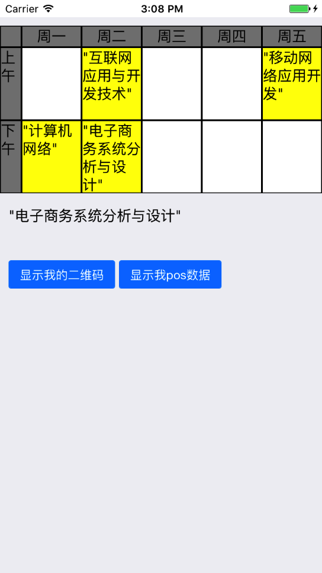
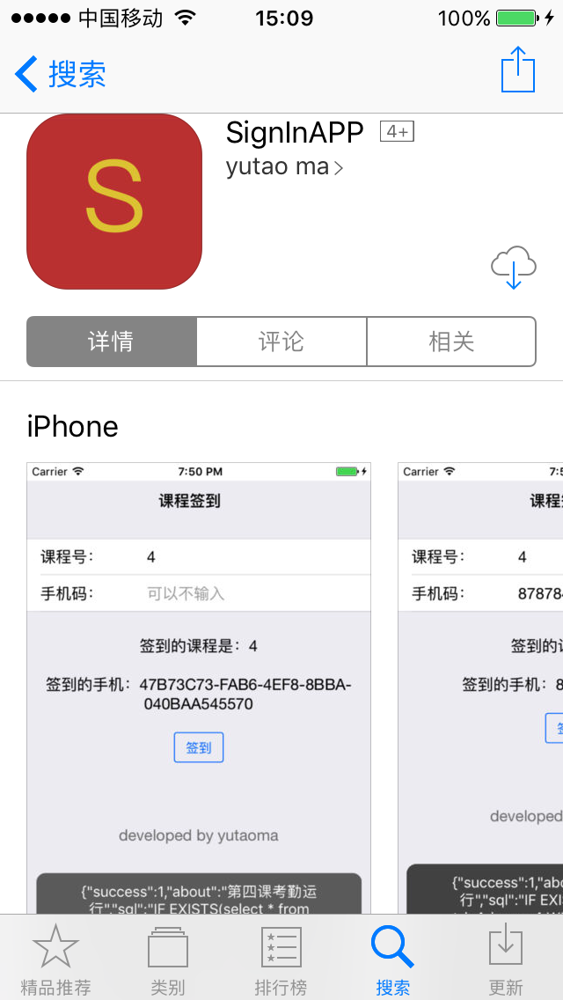

# CSManagement
**期末课程作业——课程管理**
## 完成功能

* 点击格子弹出picker，可以选择，插入，变色
* 连接数据库，实现记录单用户使用记录功能

## 图示

   
--------------
    

# Sign App
**课程签到App**
## 说明
因为前几周课需要课程签到，每次需要改参数，所以干脆写了个小程序，方便签到，但之后的课也没有再签到...

已发布App Store

## 图示

