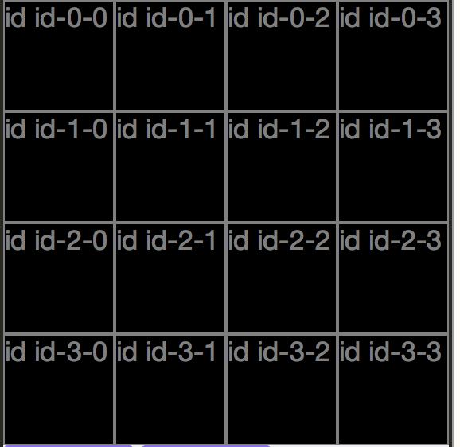
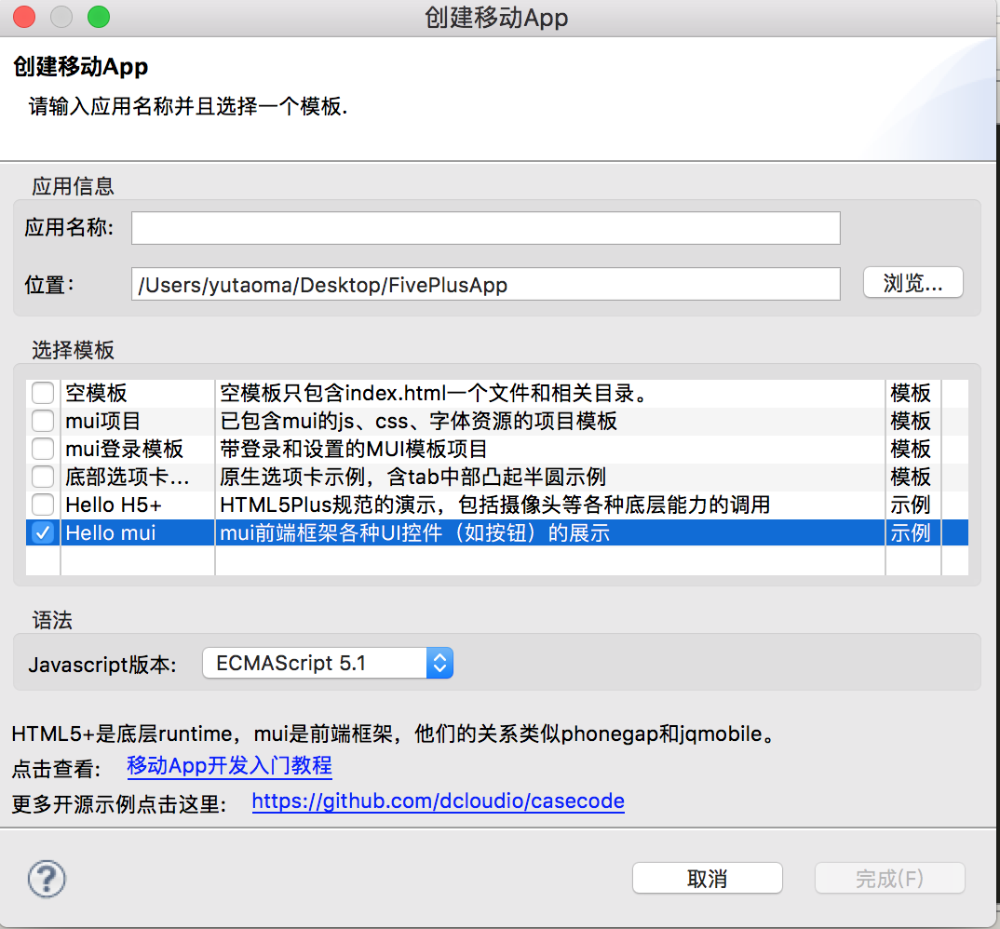
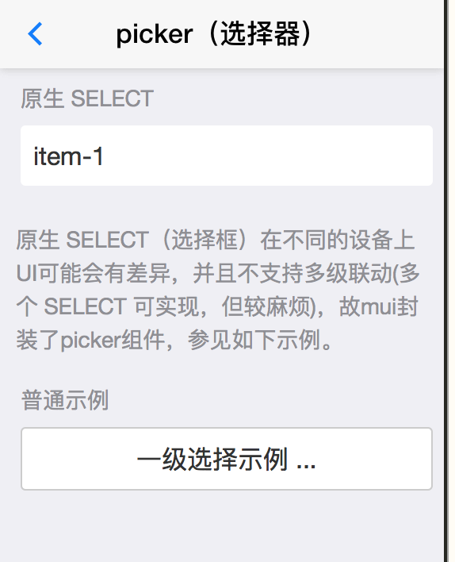
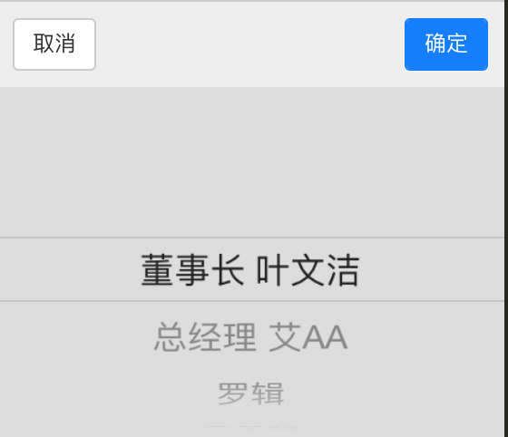
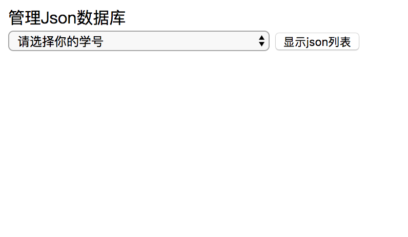

# 《移动网络应用开发》期末设计简明教程

**_在开始阅读此教程之前，请知晓以下几点：_**<br>
> * 本教程的代码均是源自mui框架示例代码以及老师教学代码，需要读者通过本教程理解这些代码之后再编写自己的程序
> * 本教程会给出实现期末设计的逻辑思路，但没有**设计的代码**
> * 本教程只适合想要通过学习来完成设计的同学，想要简单快速完成设计的同学请出门左转，本教程不适合你
> * 任何关于逻辑上的问题可以联系本教程作者，但关于编程基础问题例如：变量、函数、控制语句等请自行百度学习
> 
>    **以上！**

<br>
###好了，那让我们来愉快的开始吧！
<br>
##期末设计模块
**期末设计大致可以分为以下四个部分：**<br><br>
1. UI(界面)布局设计：在界面中画出你的课程表、菜单、选座界面等等等。<br>
2.	逻辑实现：实现点击格子弹出picker，点击picker的确定按钮后在格子中插入所选择的内容。<br>
3. 连接老师的小霸王数据库<br>
4. 添加二维码界面
<br><br>
**每一部分的教程顺序：**<br>理解老师或示例代码 ——> 思考自己的需求 ——> 实现逻辑步骤
## 一、UI设计
这一部分主要就是用`课程2小游戏`的代码：

```javascript
var LIST = 4;  //设置界面为四列
board.innerHTML = ""; // 让写在html里面的id为board的标签清空，一定要在html里面要先有id为board的标签！！！
var w = document.body.clientWidth / LIST;  //document.body.clientWidth代表设备宽度，除以列数就代表一个格子的宽度
for(var i = 0; i < LIST; i ++) {
	for(var j = 0; j < LIST; j ++) {
		var de = document.createElement("div"); //创建了一个HTMLDivElement类型变量，相当于在html里面写了一个<div>标签
      	de.setAttribute('style', 'float: left;width: '+w+'px;height: '+w+'px;border: solid 1px #808080;color: #808080;'); //设置各种长宽属性，如果想要改某些格子的长宽，可以在这个循环里面使用控制语句来改变长宽
      	de.setAttribute('class', 'div0'); //设置class属性为div0，为之后改变格子颜色做准备
      	de.setAttribute('data-i', i);  //设置i坐标
      	de.setAttribute('data-j', j);	 //设置j坐标
      	de.setAttribute('id','id-'+i+'-'+j);  //设置属性ID
      	de.innerHTML = 'id','id-'+i+'-'+j;  //这一句很重要！！！给de加入字符串，就是插入字，之后在实现逻辑点击picker的确定之后可能需要把字插入到这个div当中
      	de.addEventListener('tap', function(e) {getSelectedPos(this)} ); // 给de加一个监听事件getSelectedPos(this)，同时会把自己作为参数传入，通俗来讲就是点一下de标签以后会做getSelectedPos方法里面的事情
      	board.appendChild(de); //让de在html的board当中显示出来
    };
};
```
理解以上代码之后，你就可以复制修改以上代码，把它变成自己需要的东西了。
因为我的div0设置的背景颜色设置的是黑色，所以以上代码的结果是这样子，相应的坐标也能够看到：
<div align = "center">

</div>

## 二、逻辑实现
这一部分主要是使用mui示例代码，可以在HBuilder当中新建一个hello mui项目：
<div align = "center">

</div>
在项目的example文件夹里面找到picker.html打开，视图如下：
<div align = "center">

</div>
我们要的就是这个：
<div align = "center">

</div>
然后看picker.html里面的代码：

```
//先配置一下，把要加的js和css文件都在相应的文件夹里面找到，加入到自己的项目文件夹当中，然后在代码中导入一下
<link href="../css/mui.picker.css" rel="stylesheet" />
<link href="../css/mui.poppicker.css" rel="stylesheet" />
<script src="../js/mui.picker.js"></script>
<script src="../js/mui.poppicker.js"></script>
```
然后是实现代码：

```
//应该大部分的同学需要的就是一级选择，但因为实际有点复杂，所以建议同学可以把picker.html文件夹中的所有实现代码都复制粘贴到自己的项目当中，然后慢慢删改

//写在html body当中的部分
<button id='showUserPicker' class="mui-btn mui-btn-block" 
<div id='userResult' class="ui-alert"></div>

//js代码
(function($, doc) {
	$.init();
	$.ready(function() {
		var _getParam = function(obj, param) {
			return obj[param] || '';
		};
		//普通示例
		
		var userPicker = new $.PopPicker();  // 新建了一个PopPicker对象，也就是弹出的那个东西，就是picker
		//设置picker里面的数据，修改添加自己的数据也请按照以下的格式
		userPicker.setData([{
			value: 'ywj',
			text: '董事长 叶文洁'
		}, {
			value: 'aaa',
			text: '总经理 艾AA'
		}, {
			value: 'lj',
			text: '罗辑'
		}, {
			value: 'ymt',
			text: '云天明'
		}]);
		
		var showUserPickerButton = doc.getElementById('showUserPicker');//获取到html当中id为showUserPicker的HTMLDivElement，就是获取到了那个按钮
		var userResult = doc.getElementById('userResult');//获取到html当中id为showUserPicker的HTMLDivElement，获取到结果显示的div
		//给showUserPickerButton按钮添加了监听事件
		showUserPickerButton.addEventListener('tap', function(event) {
			//这个方法里面是点击按钮以后会发生的事件。
			//userPicker.show方法就是让我们刚刚设置的picker弹出来
			userPicker.show(function(items) {
				//这个方法里面是点击弹出picker的确定按钮后会发生的事件
				userResult.innerText = JSON.stringify(items[0]);//让刚在获取到的结果显示的div显示picker选择的字符，也就是说JSON.stringify(items[0])调用了所显示的值，包括value和text，你可以继续调用你需要的值，比如说JSON.stringify(items[0].text)
			});
		}, false);
	});
})(mui, document);

```

***在理解以上部分之后你就需要写适应自己需求的代码了！*** <br>
***首先来确定你的需求*** <br>
### 需求：

1.点击所有的格子都会弹出picker

2.点击picker的确定按钮之后会在相应的格子里做相应的变化，比如`变色`、`插字`等。


### 实现步骤：

1.回到UI设计部分，你可以看到我给de添加的监听事件方法`getSelectedPos`，在这个方法里你需要获取到当前你点击的格子的坐标：

```
var gayi
var gayj
      				
function getSelectedPos(obj) {
	gayi = obj.dataset.i; //获取被选择的格子的i坐标
	gayj = obj.dataset.j; //获取被选择的格子的j坐标
	console.log("gayi = " + obj.dataset.i + ", gayj ="  + obj.dataset.j); //这里加了一个输出，可以看下控制台输出的坐标对不对
};
```
因此在每次点击一个格子之后，就会调用一次getSelectedPos方法，把被选择的格子的坐标传给gayi和gayj。

2.我们需要点击每个格子都会弹出picker，因此需要像在开始画UI界面那样写两个循环，然后在里面通过`坐标：i，j`来获取到每个格子，再给格子添加 show picker 的事件，然后在点击弹出picker的确定按钮后会发生的事件当中加入行为——通过` gayi `和` gayj `获取到点击的格子，然后给点击的格子innerText并且改变格子颜色。

```
通过循环获取到的每个格子.addEventListener('tap', function(event) {
	userPicker.show(function(items) {
		if(JSON.stringify(items[0].text) == "\"不选\"") {
			通过gayi和gayj获取的格子.innerText = "";
			通过gayi和gayj获取的格子.setAttribute('class','div0');//div0是没有选择状态的class
		} else {
			通过gayi和gayj获取的格子.innerText = JSON.stringify(items[0].text);
			通过gayi和gayj获取的格子.setAttribute('class','div1');
		}
	});
}, false);
```

这里我在设计picker数据时，添加了一个`“不选”`的数据，当选择这个数据时候，通过判断来控制是否要给选择的格子插入字改变背景颜色。

<br><br>
**恭喜你！当你实现到这一步时，就完成了本设计的大部分功能，喝杯茶庆祝下吧！**🍵
<br><br>
## 三、连接小霸王数据库
这一部分主要参考课程10的代码，并需要通过 [http://www.huiwaizhi.com/Json/lixin/jl.asp
](数据库链接)来建表<br><br>
**首先要导入lixin.js，对！就是它，前几次课签到一直要用到的文件；文件的复制和代码部分都不要忘记。**
### 建表、建立插入查询语句
进入网站之后，是下面这个界面：
<div align = "center">

</div>
选择自己的学号之后，点击显示json列表，然后就可以点击新建一个json
<div align = "center">

</div>

* 其中学号是不能变的；<br>
* Json调用的编号可以随意填写，之后在代码调用的链接地址中会用到这里的编号；<br>
* 参数列表，就是要传入的参数，比如之后需要把格子的坐标传入，就需要在这里添加参数，如果这里写 `a`，之后在代码中的参数名也必须是`a`；
* SQL编辑器，这里是写SQL语句的。

```
/*建表*／
CREATE TABLE t_t10_你的学号 ( t10_ID varchar (20) , t10_field1 varchar (50) , t10_field2 varchar (50) , t10_field3 varchar (50) )

/*查询*/
select * from t_t10_你的学号

／*插入&更新*／
IF EXISTS(select * from t_t10_你的学号 WHERE t10_ID = '@0') update t_t10_你的学号 set t10_field3=getdate() WHERE t10_ID = '@0' ELSE insert into t_t10_你的学号 (t10_ID ) values ('@0')
```
请根据你自己的需求来编写相应的SQL语句

再看代码部分：

```
//首先需要调用一下你建表的json，把表先建起来，建起来之后就可以注释调了
myxhr(LogByJsonStr,urlroot+"j.asp?j=调用的编号&s=你的学号");

//查询方法
function ShowByJsonStr(JsonStr) {
	var JsonObj = eval("("+JsonStr+")");
	var rows = JsonObj["rows"];
	var str = '';
	for(var i = 0; i < rows.length; i ++){
		str = '';
		str+=rows[i].t10_ID;//这里调用到了你的列名，请务必理解这一点！！！打个比方，如果你的一个表当中有一列名为position，你需要获取每条数据的position，那么你就可以通过 rows[i].position 来获取到。真的请务必理解这一点！！！
	}
}
function fun_select() {
	myxhr(ShowByJsonStr,urlroot+"j.asp?j=调用的编号&s=你的学号");  //第一个参数是上面的方法，意思就是将从第二个参数链接获取到的数据传入第一个参数的方法当中，然后做第一个方法中的事情
};

//插入&更新的方法
function fun_insert() {
	var postdata="";
	postdata += "a=" + "1"; //这里加入了参数,拿上面的插入&更新作比方，你做的事情就是先查询一下表里面有没有t10_ID=1的数据，有的话就更新一下set t10_field3=getdate()，没有的话就插入一条t10_ID=1的数据
	postdata += "&b=" + "时间"; //这是第二个参数，连接起来需要一个&符号
	myxhr(LogByJsonStr,urlroot+"j.asp?j=调用的编号&s=你的学号",postdata);
};
```

### 思考你的需求
老师大概需通过数据库实现的功能就是，打开App选择了一些，关闭再打开的时候需要获取到之前选择的那些。

### 实现步骤
你需要在每次点击picker的确定按钮的时候也把数据传入到数据库当中：

```
//继续之前逻辑部分的代码

通过循环获取到的每个格子.addEventListener('tap', function(event) {
	userPicker.show(function(items) {
		if(JSON.stringify(items[0].text) == "\"不选\"") {
			通过gayi和gayj获取的格子.innerText = "";
			通过gayi和gayj获取的格子.setAttribute('class','div0');//div0是没有选择状态的class
			var posStr = String(gayi) + String(gayj);// 在这里我将坐标封装成一个字符串，然后直接传入到数据库当中，你也可以像老师说的那样，把坐标i，j作为int类型分别传入数据库当中
      		fun_insert(posStr,"不选") 
		} else {
			通过gayi和gayj获取的格子.innerText = JSON.stringify(items[0].text);
			通过gayi和gayj获取的格子.setAttribute('class','div1');
			var posStr = String(iSelected) + String(jSelected);
      		fun_insert(posStr,JSON.stringify(items[0].text));
		}
	});
}, false);
```

在界面初始化，也就是在画好格子之后需要从数据库读取数据，看一下每个格子的数据：

```
function ShowByJsonStr(JsonStr){
	var JsonObj = eval("("+JsonStr+")");
	var rows = JsonObj["rows"];
	var posStr = '';
	var classStr = '';
	for(var i=0; i<rows.length; i++){
		posStr = '';
		posStr += rows[i].divPos;
		classStr = '';
		classStr += rows[i].className;
		//如果格子是有数据的，不是"不选"，那么要把字插入，改变背景颜色
		if(classStr != "不选") {
			var gayi = Number(posStr.substr(0, 1));  //把封装为string类型的坐标拆解分析出来
			var gayj = Number(posStr.substr(1, 2));
			var changedDiv = document.getElementById('id-'+ gayi +'-'+ gayj);
			changedDiv.innerText = classStr;
			changedDiv.setAttribute('class','div1'); // div1是选择状态的class
		}
	};
}
      	
myxhr(ShowByJsonStr,urlroot+"j.asp?j=调用的编号&s=你的学号");  //调用！
```


**到这里基本就完成了所有的内容了，如果你已经到了这里，完全不用担心，二维码的部分十分十分十分简单！！！一鼓作气做完它吧！！！**
<br><br>
## 四、二维码
1. 把最后山寨微信当中的`info.html`复制粘贴到自己的项目中；
2. 导入 `qrcode.min.js`，代码和文件部分同样都不要忘记；
3. ```<a href="info.html"><button class="mui-btn-blue">按钮</button></a> //在html的body当中加入以此代码```
4. 在 info.html 文件中修改自己的链接、标题、图片、名字、座右铭

```
<h1 class="mui-title">你的标题</h1>

<p id="debug">你的姓名<br>
					你的座右铭</p>

var qrcode = new QRCode('qrcode2', {
  				text: '你的链接',
  				width: 256,
  				height: 256,
  				colorDark : '#000000',
  				colorLight : '#ffffff',
  				correctLevel : QRCode.CorrectLevel.H
			});
			
			
var i2=new Image();
i2.src = 'img/你的图片.png';
```
以上代码都在文件中存在，你只需要找到位置，修改我的中文字部分就可以。

## 结束
🦉希望本教程可以帮助到你🍣


